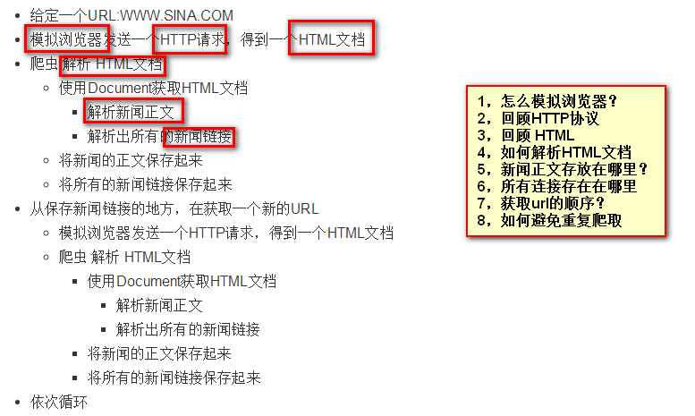

### 爬虫开发的技术问题

* 如何模拟浏览器发送一个HTTP请求？
	* 模拟发送请求
		* Java基础 HttpUrlConnection
		* HttpClient 快速网络网络
	* HTTP协议
		* 回顾
* 如何解析HTML文档？
	* 回顾HTML文档
	* 如何快速解析Document获得想要数据？
	* Jsoup为解析HTML而生
* 解析出来的数据保存到哪里？
	* 新闻正文保存到哪里？
		* 保存到数据库/文本文件/分布式文件系统（不需要了解）
		* 特点：解析出来之后，不再修改，可以固定保存
	* 所有新的URL保存到哪里？
		* 读取URL需要一个顺序（先进先出）
			* 队列 Queue
			* 多线程下的BlockingQueue
* 如何避免重复爬取？
	* 标记已经爬取过的数据？
	* 标记爬取
		* 在爬取之前，先去一个地方查询改URL是否爬取过
		* 如果没有爬取，就发去HTTP请求，爬取URL
			* 爬取成功之后，就将URL放入已经爬取的队列中。
		* 如果已经爬取过，就不爬取
	* SET处理，非空去重。
* 性能问题
	* 单个线程爬取页面信息，比较慢而URL又特别多？
	* 多线程
		* 回顾线程
		* 学习多线程运用