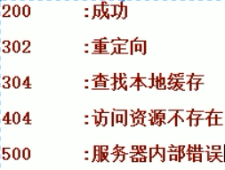

6天，爬虫与搜索系统

* 爬虫
	* 什么是爬虫？
		爬虫（网络爬虫），是一种运行在互联网上用来获取数据的自动化程序或者脚本。
		* 互联网：各种形形色色的网站
			* 新闻网站，网易，搜狐，今日头条……
			* 视频网站，优酷，爱奇艺
			* ……
		* **获取数据**：不同类型，不同行业网站上的数据
		* 自动化：通过程序实现自动化，尽可能减少人工干预。
	* 3天
		* 爬虫开发的基础技术
		* 使用Redis开发一个分布式爬虫
		* 爬虫开发中常见问题及解决（反爬虫技术）
	* 目标
		* 心中有剑，万物都是剑 
* 搜索
	* 什么搜索？
		* 百度一下，你就知道
		* 根据用户的关键词在爬虫爬取回来的数据中进行查询的一种服务
	* 3天
		* 搜索引擎底层框架
		* 分布式搜索引擎框架
		* 对外一个Web服务实现搜索
	* 目标
		* 理解搜索系统的开发流程
		* 实现一个类似于百度的搜索引擎


##第一阶段 爬虫开发

### 1、爬虫开发的基础知识

####1.1、爬虫是什么？
	
爬虫（网络爬虫），是一种运行在互联网上用来获取数据的自动化程序或者脚本。
* 互联网：各种形形色色的网站
	* 新闻网站，网易，搜狐，今日头条……
	* 视频网站，优酷，爱奇艺
	* ……
* **获取数据**：不同类型，不同行业网站上的数据
* 自动化：通过程序实现自动化，尽可能减少人工干预。

####1.2、爬虫抓取的数据有什么用？
* 帮助用户从海量数据中快捷获取到有用的信息
* 获取微博，QQ，微信中的数据，做数据分析
	* 用户社交圈：关注了谁，谁是你的好友的好友
	* 用户的喜好：你关注、评论的话题、文章
	* ……
* 获取政府公开数据
	* 公司注册信息
	* 法院信息收集，标记违法人或者公司
	* ……
* 获取行业的信息
	* 互联网电商：淘宝，京东，苏宁，国美
		* 小米手机的价格，销量，评价
	* 行业领头羊公司经营分析

通过不同渠道和手段爬取需要的数据，解决某一个类特定的问题。

#### 1.3、爬虫的简单分类
* 垂直爬虫
	* 只爬取一类信息
		* 垂直爬虫A：只爬取公司注册信息
		* 垂直爬虫B：只爬取法院的信息
* 通用爬虫
	* 爬取互联网上所有出现网站的信息
		* 百度
		* 谷歌
爬虫的分类有很多，我们一般爬虫爬取的数据范围进行分类，如果只爬取一类数据我们叫做垂直爬虫，如果是爬取互联网上所有的网站数据，我们叫做通用爬虫。

####1.4、爬虫的基本运行原理

普通用户获取新浪网站上的数据的操作记录

* 打开浏览器
* 输入一个网址：www.sina.com
* 新浪服务器返回一个HTML文档
	* 获取HTML文档里面新闻链接
		* 从所有的连接里面选择一个
* 点击链接，通过浏览器发送HTTP请求
* 新闻对应的服务器返回一个HTML文档
	* 新闻内容：标题，内容，作者，发布时间，点赞
	* 解析除了新闻内容之外的相关信息的连接
		* ？保存起来
* 保存新闻的内容

爬虫的步骤
* 给定一个URL:WWW.SINA.COM
* 模拟浏览器发送一个HTTP请求，得到一个HTML文档
* 爬虫 解析 HTML文档
	* 使用Document获取HTML文档
		* 解析新闻正文
		* 解析出所有的新闻链接
	* 将新闻的正文保存起来
	* 将所有的新闻链接保存起来
* 从保存新闻链接的地方，在获取一个新的URL
	* 模拟浏览器发送一个HTTP请求，得到一个HTML文档
	* 爬虫 解析 HTML文档
		* 使用Document获取HTML文档
			* 解析新闻正文
			* 解析出所有的新闻链接
		* 将新闻的正文保存起来
		* 将所有的新闻链接保存起来 
* 依次循环

####1.5、爬虫开发的技术问题
* 如何模拟浏览器发送一个HTTP请求？
	* 模拟发送请求
	* HTTP协议
* 如何解析HTML文档？
	* 回顾HTML文档
	* 如何快速解析Document获得想要数据？
* 解析出来的数据保存到哪里？
	* 新闻正文保存到哪里？
		* 保存到数据库/文本文件
		* 特点：解析出来之后，不再修改，可以固定保存
	* 所有新的URL保存到哪里？
		* 读取URL需要一个顺序（先进先出）
			* 队列 Queue
* 如果等待爬取的URL中有重复URL时，是不是要多次爬取？
	* 如何避免重复爬取？
		* 标记已经爬取过的数据？
		* 标记爬取
			* 在爬取之前，先去一个地方查询改URL是否爬取过
			* 如果没有爬取，就发去HTTP请求，爬取URL
				* 爬取成功之后，就将URL放入已经爬取的队列中。
			* 如果已经爬取过，就不爬取
		* SET处理，非空去重。
* 单个线程爬取页面信息，比较慢而URL又特别多？
	* 多线程


##### 1.5.1 如何模拟浏览器发送一个HTTP请求？
* 回顾HTTP协议
	* HTTP是一个客户端和服务器端请求和应答的标准（TCP）。客户端是终端用户，服务器端是网站。通过使用Web浏览器、网络爬虫或者其它的工具，客户端发起一个到服务器上指定端口（默认端口为80）的HTTP请求。

	* 客户端向服务器发送一个请求，请求头包含请求的方法、URL、协议版本、以及包含请求修饰符、客户信息和内容的类似于MIME的消息结构。
	* 服务器以一个状态行作为响应，响应的内容包括消息协议的版本，成功或者错误编码加上包含服务器信息、实体元信息以及可能的实体内容。
	* 通常HTTP消息包括客户机向服务器的请求消息和服务器向客户机的响应消息。这两种类型的消息由一个起始行，一个或者多个头域，一个指示头域结束的空行和可选的消息体组成。

	* HTTP的头域包括通用头，请求头，响应头和实体头四个部分。每个头域由一个域名，冒号（:）和域值三部分组成。域名是大小写无关的，域值前可以添加任何数量的空格符，头域可以被扩展为多行，在每行开始处，使用至少一个空格或制表符。
	* HTTP常见状态码   [所有的状态码:百度百科](http://baike.baidu.com/link?url=zZnwNYkU6BOnCYJppHe3aw5f3lW2AgzxWGfSYmAqck5ytYmSN8FT_BxCslKYK7grv0wdWsXeezd1aIQM6HpKSa)


* 模拟浏览器发送请求

使用原生API发送Get请求
```java
public class Get {
    public static final String USER_AGENT = "Mozilla/5.0";
    public static void main(String[] args) throws IOException {
        //1、准备要访问的URL
        String url = "http://www.itcast.cn";
        URL obj = new URL(url);
        HttpURLConnection con = (HttpURLConnection) obj.openConnection();

        //2、设置Http协议的参数
        // optional default is GET
        con.setRequestMethod("GET");
        //add request header
        con.setRequestProperty("User-Agent", USER_AGENT);

        //3、发起HTTP请求，获取状态码
        int responseCode = con.getResponseCode();
        System.out.println("\nSending 'GET' request to URL : " + url);
        System.out.println("Response Code : " + responseCode);

        //4、如果是正常相应，读取数据
        if (responseCode == 200) {
            BufferedReader in = new BufferedReader(
                    new InputStreamReader(con.getInputStream()));
            String inputLine;
            StringBuffer response = new StringBuffer();
            while ((inputLine = in.readLine()) != null) {
                response.append(inputLine);
            }
            in.close();
            //print result
            System.out.println(response.toString());
        }
    }
}
```

使用原生API发送Post请求
```java
package cn.itcast.pcss.base.httpurlconnection;

import java.io.BufferedReader;
import java.io.DataOutputStream;
import java.io.IOException;
import java.io.InputStreamReader;
import java.net.HttpURLConnection;
import java.net.URL;

public class Post {
    public static final String USER_AGENT = "Mozilla/5.0";
    public static void main(String[] args) throws IOException {
        String url = "http://sspc.itcast.cn/login/login.html";
        URL obj = new URL(url);
        HttpURLConnection con = (HttpURLConnection) obj.openConnection();

        //add reuqest header
        con.setRequestMethod("POST");
        con.setRequestProperty("User-Agent", Post.USER_AGENT);
        con.setRequestProperty("Accept-Language", "en-US,en;q=0.5");

        String urlParameters = "username=maoxiangyi&password=&maoxiangyi&reURL=http://shop.itcast.cn/item/itemList.html";

        // Send post request
        con.setDoOutput(true);
        DataOutputStream wr = new DataOutputStream(con.getOutputStream());
        wr.writeBytes(urlParameters);
        wr.flush();
        wr.close();

        int responseCode = con.getResponseCode();
        System.out.println("\nSending 'POST' request to URL : " + url);
        System.out.println("Post parameters : " + urlParameters);
        System.out.println("Response Code : " + responseCode);
        if (responseCode == 200) {
            BufferedReader in = new BufferedReader(new InputStreamReader(con.getInputStream()));
            String inputLine;
            StringBuffer response = new StringBuffer();
            while ((inputLine = in.readLine()) != null) {
                response.append(inputLine);
            }
            in.close();
            System.out.println(response.toString());
        }
    }
}
```
* 更高级的请问方式

使用HTTPClient进行Get请求
```java
```
使用HTTPClient进行Post请求
```java
```
使用HTTPClient进行Get请求-简单API
```java
```
使用HTTPClient进行Post请求-简单API
```java
```

#####1.5.2 如何解析HTML文档？
* HTML知识回顾
	* 什么是 HTML？
		* HTML 指的是超文本标记语言 (Hyper Text Markup Language)，“超文本”就是指页面内可以包含图片、链接，甚至音乐、程序等非文字元素。
		* 超文本标记语言的结构包括“头”部分（英语：Head）、和“主体”部分（英语：Body），其中“头”部提供关于网页的信息，“主体”部分提供网页的具体内容。
	* HTML的构成
	head 元素是所有头部元素的容器。<head> 内的元素可包含脚本，指示浏览器在何处可以找到样式表，提供元信息，等等。
以下标签都可以添加到 head 部分。[更多信息](http://www.w3school.com.cn/html/html_head.asp)
		* HTML
			* head
				* title 
					* 定义浏览器工具栏中的标题
					* 提供页面被添加到收藏夹时显示的标题
					* 显示在搜索引擎结果中的页面标题
				* base
					* 标签为页面上的所有链接规定默认地址或默认目标（target）
						```java <base href="http://www.w3school.com.cn/images/" /> ```
						```java <base target="_blank" /> ```
				* link
					* 定义文档与外部资源之间的关系
					* 标签最常用于连接样式表
					* ```java <link rel="stylesheet" type="text/css" href="mystyle.css" />```
				* meta
					* 元数据（metadata）是关于数据的信息
					* 元数据总是以名称/值的形式被成对传递的
					* 标签提供关于 HTML 文档的元数据。元数据不会显示在页面上，但是对于机器是可读的。
					* 典型的情况是，meta 元素被用于规定页面的描述、关键词、文档的作者、最后修改时间以及其他元数据。
						* http-equiv 服务器发送给服务器的标识
							* content-type 文档类型，[查看更多的content-type相关](http://tool.oschina.net/commons/)
								所有服务器都**至少**要发送一个：content-type:text/html。这将告诉浏览器准备接受一个 HTML 文档。
							* expires 文档过期时间
								```java <meta http-equiv="expires" content="31 Dec 2008"> ```
							* refresh 用于刷新与跳转(重定向)页面
								* 5秒之后刷新本页面
									```java <meta http-equiv="refresh" content="5" />```
								* 5秒之后转到[传智播客](http://www.itcast.cn)首页
									```java <meta http-equiv="refresh" content="5; url=http://www.itcast.cn/" />```
							* set-cookie cookie设定，如果网页过期，存盘的cookie将被删除。需要注意的也是必须使用GMT时间格式； 
								```java <meta    http-equiv="set-cookie"    contect="Mon,12    May    2001    00:20:00    GMT(格林尼治标准时间)"> ```    
							* charset 文档编码格式
								```java <meta http-equiv="charset" content="iso-8859-1">```
						* name
							* author 告诉搜索引擎你的站点的制作的作者
							* description 告诉搜索引擎你的站点的主要内容
							* keywords 向搜索引擎说明你的网页的关键词
							* generator  用以说明生成工具
							* revised 定义页面的最新版本
							* others 其它
						* scheme 
							* some_text
		
					* **一些搜索引擎会利用 meta 元素的 name 和 content 属性来索引您的页面。**
				* script
					* 标签用于定义客户端脚本，比如 JavaScript。
				* style
					* 标签用于为 HTML 文档定义样式信息
					* ```java <style type="text/css"> body {background-color:yellow} p {color:blue} </style>```
			* body
		* HTML

	* 下图是[传智播客](http://www.itcast.cn)官网首页的HTML源码截选。


* 使用Document获取文本数据
	* Document是什么
	每个载入浏览器的 HTML 文档都会成为 Document 对象。
	Document 对象使我们可以从脚本中对 HTML 页面中的所有元素进行访问。

	* Document 对象集合
		* all[]	提供对文档中所有 HTML 元素的访问。
		* anchors[]	返回对文档中所有 Anchor 对象的引用。
		* applets	返回对文档中所有 Applet 对象的引用。
		* forms[]	返回对文档中所有 Form 对象引用。
		* images[]	返回对文档中所有 Image 对象引用。
		* links[]	返回对文档中所有 Area 和 Link 对象引用。

	* Document 对象属性
		* body	提供对 <body> 元素的直接访问。 对于定义了框架集的文档，该属性引用最外层的 <frameset>。
		* cookie	设置或返回与当前文档有关的所有 cookie。
		* domain	返回当前文档的域名。
		* lastModified	返回文档被最后修改的日期和时间。
		* referrer	返回载入当前文档的文档的 URL。
		* title	返回当前文档的标题。
		* URL	返回当前文档的 URL。
	* Document 对象方法
		* close()	关闭用 document.open() 方法打开的输出流，并显示选定的数据。
		* getElementById()	返回对拥有指定 id 的第一个对象的引用。
		* getElementsByName()	返回带有指定名称的对象集合。
		* getElementsByTagName()	返回带有指定标签名的对象集合。
		* open()	打开一个流，以收集来自任何 document.write() 或 document.writeln() 方法的输出。
		* write()	向文档写 HTML 表达式 或 JavaScript 代码。
		* writeln()	等同于 write() 方法，不同的是在每个表达式之后写一个换行符。
	* **在Chrome Browse中操作Document**

