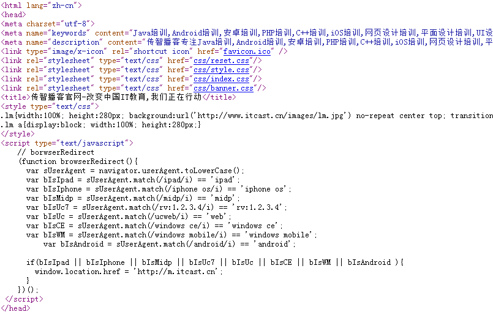

## HTML基础知识回顾
HTML知识回顾
* 什么是 HTML？
	* HTML 指的是超文本标记语言 (Hyper Text Markup Language)，“超文本”就是指页面内可以包含图片、链接，甚至音乐、程序等非文字元素。
	* 超文本标记语言的结构包括“头”部分（英语：Head）、和“主体”部分（英语：Body），其中“头”部提供关于网页的信息，“主体”部分提供网页的具体内容。
* HTML的构成
	head 元素是所有头部元素的容器。<head> 内的元素可包含脚本，指示浏览器在何处可以找到样式表，提供元信息，等等。
以下标签都可以添加到 head 部分。[更多信息](http://www.w3school.com.cn/html/html_head.asp)
	* HTML
		* head
			* title 
				* 定义浏览器工具栏中的标题
				* 提供页面被添加到收藏夹时显示的标题
				* 显示在搜索引擎结果中的页面标题
			* base
				* 标签为页面上的所有链接规定默认地址或默认目标（target）
					```java <base href="http://www.w3school.com.cn/images/" /> ``
					```java <base target="_blank" /> ```
			* link
				* 定义文档与外部资源之间的关系
				* 标签最常用于连接样式表
				* ```java <link rel="stylesheet" type="text/css" href="mystyle.css" />```
			* meta
				* 元数据（metadata）是关于数据的信息
				* 元数据总是以名称/值的形式被成对传递的
				* 标签提供关于 HTML 文档的元数据。元数据不会显示在页面上，但是对于机器是可读的。
				* 典型的情况是，meta 元素被用于规定页面的描述、关键词、文档的作者、最后修改时间以及其他元数据。
					* http-equiv 服务器发送给服务器的标识
						* content-type 文档类型，[查看更多的content-type相关](http://tool.oschina.net/commons/)
								所有服务器都**至少**要发送一个：content-type:text/html。这将告诉浏览器准备接受一个 HTML 文档。
						* expires 文档过期时间
							```java <meta http-equiv="expires" content="31 Dec 2008"> ```
						* refresh 用于刷新与跳转(重定向)页面
							* 5秒之后刷新本页面
								```java <meta http-equiv="refresh" content="5" />```
							* 5秒之后转到[传智播客](http://www.itcast.cn)首页
								```java <meta http-equiv="refresh" content="5; url=http://www.itcast.cn/" />```
						* set-cookie cookie设定，如果网页过期，存盘的cookie将被删除。需要注意的也是必须使用GMT时间格式； 
							```java <meta    http-equiv="set-cookie"    contect="Mon,12    May    2001    00:20:00    GMT(格林尼治标准时间)"> ```    
						* charset 文档编码格式
							```java <meta http-equiv="charset" content="iso-8859-1">```
					* name
						* author 告诉搜索引擎你的站点的制作的作者
						* description 告诉搜索引擎你的站点的主要内容
						* keywords 向搜索引擎说明你的网页的关键词
						* generator  用以说明生成工具
						* revised 定义页面的最新版本
						* others 其它
					* scheme 
						* some_text
		
					* **一些搜索引擎会利用 meta 元素的 name 和 content 属性来索引您的页面。**
			* script
					* 标签用于定义客户端脚本，比如 JavaScript。
			* style
				* 标签用于为 HTML 文档定义样式信息
				 ```java <style type="text/css"> body {background-color:yellow} p {color:blue} </style>```
		* body
	* HTML

* 下图是[传智播客](http://www.itcast.cn)官网首页的HTML源码截选。

