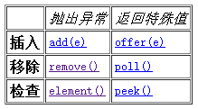

### 队列基础
基本概念
* Queue用于模拟队列这种数据结构。
* 队列通常是指“先进先出（FIFO）”的容器。
* 队列的头部保存在队列中存放时间最长的元素，尾部保存存放时间最短的元素。
* 新元素插入到队列的尾部，取出元素会返回队列头部的元素。
* 通常，队列不允许随机访问队列中的元素。
* 在java5中新增加了java.util.Queue接口，用以支持队列的常见操作。该接口扩展了java.util.Collection接口。Queue使用时要尽量避免Collection的add()和remove()方法，而是要使用offer()来加入元素，使用poll()来获取并移出元素。它们的优点是通过返回值可以判断成功与否，add()和remove()方法在失败的时候会抛出异常。 如果要使用前端而不移出该元素，使用element()或者peek()方法。

Queue的常用方法


* 插入数据
	* void add(Object e):　　将指定元素插入到队列的尾部。
	* boolean offer(Object e):　　将指定的元素插入此队列的尾部。当使用容量有限的队列时，此方法通常比add(Object e)有效。
* 移除
	* Object remove():　　获取队列头部的元素，并删除该元素。
	* Object poll():　　返回队列头部的元素，并删除该元素。如果队列为空，则返回null。
* 检查
	* object element():　　获取队列头部的元素，但是不删除该元素。
	* Object peek():　　返回队列头部的元素，但是不删除该元素。如果队列为空，则返回null。

注意一点就好，Queue通常不允许插入Null，尽管某些实现（比如LinkedList）是允许的，但是也不建议。

双端队列

Queue还有一个Deque接口，Deque代表一个“双端队列”，双端队列可以同时从两端删除或添加元素，因此Deque可以当作栈来使用。java为Deque提供了ArrayDeque实现类和LinkedList实现类。

```java
public static void main(String[] args) {
    ArrayDeque queue = new ArrayDeque();
    queue.offer("春");
    queue.offer("夏");
    queue.offer("秋");
    System.out.println(queue);
    System.out.println(queue.peek());
    System.out.println(queue);
    System.out.println(queue.poll());
    System.out.println(queue);
}
```

在多线程下queue有什么问题？

* 重复消费
* 

阻塞队列

BlockingQueue,如果BlockQueue是空的,从BlockingQueue取东西的操作将会被阻断进入等待状态,直到BlockingQueue进了东西才会被唤醒.同样,如果BlockingQueue是满的,任何试图往里存东西的操作也会被阻断进入等待状态,直到BlockingQueue里有空间才会被唤醒继续操作

* BlockingQueue阻塞队列
	* ArrayBlockingQueue
	* LinkedBlockingQueue

* 常见操作
	* add():把anObject加到BlockingQueue里,即如果BlockingQueue可以容纳,则返回true,否则报异常 
	* offer():表示如果可能的话,将anObject加到BlockingQueue里,即如果BlockingQueue可以容纳,则返回true,否则返回false. 
	* put():把anObject加到BlockingQueue里,如果BlockQueue没有空间,则调用此方法的线程被阻断直到BlockingQueue里面有空间再继续. 
	* poll():取走BlockingQueue里排在首位的对象,若不能立即取出,则可以等time参数规定的时间,取不到时返回null 
	* take():取走BlockingQueue里排在首位的对象,若BlockingQueue为空,阻断进入等待状态直到Blocking有新的对象被加入为止 

```java
public static void main(String[] args) {

    final BlockingQueue queue = new ArrayBlockingQueue(3);
    //创建三个线程 生产数据 put
    for (int i = 0; i < 2; i++) {
        new Thread() {
            public void run() {
                while (true) {
                    try {
                        Thread.sleep((long) (Math.random() * 1000));
                        System.out.println(Thread.currentThread().getName() + "--------------准备放数据!");
                        queue.put(1);
                        System.out.println(Thread.currentThread().getName() + "--------------已经放了数据，" +
                                "队列目前有" + queue.size() + "个数据");
                    } catch (InterruptedException e) {
                        e.printStackTrace();
                    }

                }
            }

        }.start();
    }
    //创建一个线程消费数据 take 数据
    new Thread() {
        public void run() {
            while (true) {
                try {
                    //将此处的睡眠时间分别改为100和1000，观察运行结果
                    Thread.sleep(1000);
                    System.out.println(Thread.currentThread().getName() + "准备取数据!");
                    queue.take();
                    System.out.println(Thread.currentThread().getName() + "已经取走数据，" +
                            "队列目前有" + queue.size() + "个数据");
                } catch (InterruptedException e) {
                    e.printStackTrace();
                }
            }
        }
    }.start();
}
```