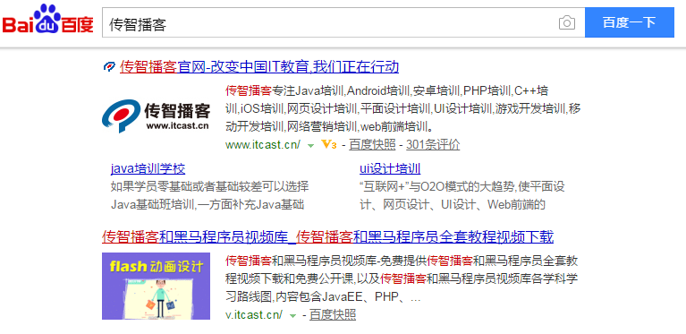

6天，爬虫与搜索系统

* 爬虫
	* 什么是爬虫？
		爬虫（网络爬虫），是一种运行在互联网上用来获取数据的自动化程序或者脚本。
		* 互联网：各种形形色色的网站
			* 新闻网站，网易，搜狐，今日头条……
			* 视频网站，优酷，爱奇艺
			* ……
		* **获取数据**：不同类型，不同行业网站上的数据
		* 自动化：通过程序实现自动化，尽可能减少人工干预。
	* 3天
		* 爬虫开发的基础技术
		* 使用Redis开发一个分布式爬虫
		* 爬虫开发中常见问题及解决（反爬虫技术）
	* 目标
		* 心中有剑，万物都是剑 
* 搜索
	* 什么搜索？
		* 百度一下，你就知道
		* 根据用户的关键词在爬虫爬取回来的数据中进行查询的一种服务
	* 3天
		* 搜索引擎底层框架
		* 分布式搜索引擎框架
		* 对外一个Web服务实现搜索
	* 目标
		* 理解搜索系统的开发流程
		* 实现一个类似于百度的搜索引擎

